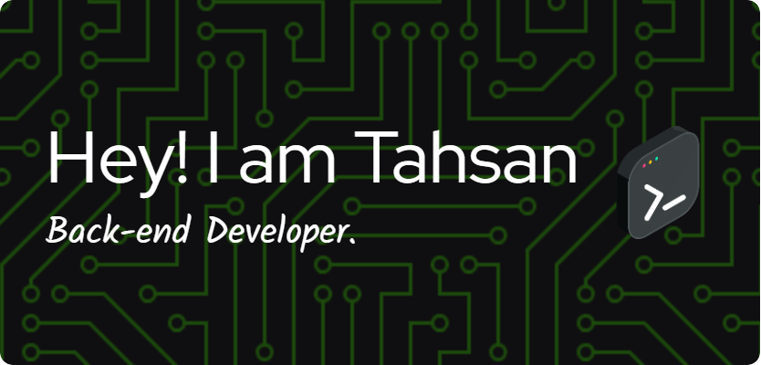

<h1 align="center">
  
</h1>

  

---

  

---

  

## **About Me**

- 🌱 Currently mastering **Data Structure and Algorithms**.  
- 💻 Passionate about **Competitive programmer**: C/C++.
- 🔭 Confidential with Python.
- ✍️ Professional at MySQL and Linux CLI.
- 🎯 Goal: Become a back-end developer and Competitive Programming Expert.  
- ⚡ Fun fact: *Coffee fuels my debugging sessions!*  

  

---

## **Competitive Programming Profiles**

  
  
  
  
  

  

---

### **LeetCode Stats**

  

  

---

## **My Favorite Tech Stack**

  

  

---

## **GitHub Stats & Streak**

  
  

  

  

---

## **Contribution Snake**
<picture>
  <source media="(prefers-color-scheme: dark)" srcset="https://raw.githubusercontent.com/platane/snk/output/github-contribution-grid-snake-dark.svg" />
  <source media="(prefers-color-scheme: light)" srcset="https://raw.githubusercontent.com/platane/snk/output/github-contribution-grid-snake.svg" />
  
</picture>

  

---

## **Connect With Me**

  
  

  

---

## 🏆 **GitHub Trophies**

  

---

## ✍️ Random Dev Quote

 
